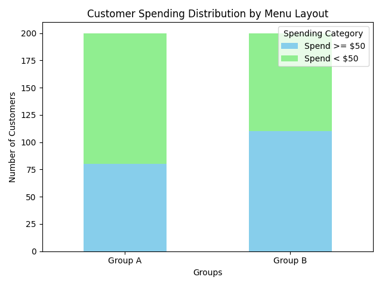

# 📊 A/B Testing on Menu Layout and Its Impact on Customer Spending

## 📌 Project Overview

A trendy restaurant seeks to determine whether changing its menu layout can positively influence customer spending behavior. The hypothesis is that emphasizing high-margin dishes might encourage higher spending. This project uses a **Chi-Square Test for Independence** to statistically analyze the association between menu layout and customer spending patterns.

---

## 📚 Problem Statement

Investigate if there's a significant difference in the proportion of customers spending **≥ \$50** between:

* **Group A (Control Group):** Current Menu Layout
* **Group B (Test Group):** New Menu Layout highlighting high-margin dishes

---

## 📊 Hypothesis

* **Null Hypothesis (H₀):**
  No association between menu layout and customer spending. (p₁ = p₂)

* **Alternative Hypothesis (H₁):**
  There is an association between menu layout and customer spending. (p₁ ≠ p₂)

---

## 📈 Methodology

* Collected observed spending data from two customer groups.
* Calculated expected frequencies assuming no association.
* Performed a **Chi-Square Test manually** and compared the statistic to a critical value at a **5% significance level**.
* Visualized customer spending distribution using a **stacked bar chart**.

---

## 📊 Results

* **Chi-Square Statistic:** 9.022
* **Critical Value (α = 0.05, df = 1):** 3.841
* **Decision:** ✅ Reject the null hypothesis.

**Conclusion:**
There is a statistically significant difference in customer spending between the two menu layouts. The new menu layout highlighting high-margin dishes likely influenced spending behavior.

---

## 📦 Files Included

* `chi_square_test.py` — Python code for Chi-Square test calculation and visualization.
* `AB-Testing-MenuLayoutScenario.pptx` — Project presentation with problem, methodology, and conclusions.
* `AB_Testing.ipynb` — Jupyter Notebook version with stepwise execution and explanations.

---

## 📑 Sample Data

| Group       | Spend ≥ \$50 | Spend < \$50 | Total |
| :---------- | :----------- | :----------- | :---- |
| **Group A** | 80           | 120          | 200   |
| **Group B** | 110          | 90           | 200   |

---

## 📉 Visualization

### 📊 Customer Spending Distribution

You can save the output chart from your Python code as an image (like `spending_distribution.png`) and include it here using:

```markdown

```


## 👥 Authors

* K. Hasmith (CB.EN.U4CSE22327)
* K. Bhavya (CB.EN.U4CSE22328)
* K. Bhavana (CB.EN.U4CSE22329)
* Krishnam Abhina (CB.EN.U4CSE22331)
* K. Sanjay (CB.EN.U4CSE22332)

---

## 📜 License

This project is intended for academic and demonstration purposes only.

---

## 📦 requirements.txt

```
numpy
scipy
pandas
matplotlib
```

---

## 📁 Recommended Project Structure

```
AB-MenuLayout-ABTest/
├── AB-Testing-MenuLayoutScenario-Group6.pptx
├── chi_square_test.py
├── AB_Testing.ipynb
├── README.md
├── requirements.txt
└── images/
    └── spending_distribution.png
```

---

## ✅ Setup Instructions

1. Install the required packages:

   ```
   pip install -r requirements.txt
   ```
2. Run the Python script or Jupyter Notebook to reproduce the results and generate the visualization.
